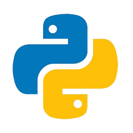

  

<h1 align="center">Learning Python</h1>

---

## About

This repository contains my journey and projects while learning Python.  
It includes exercises, small projects, and notes on various Python topics.

---

## Documentation

### Day 1
I made simple projects to get me started.  
I learned how Python reads from the keyboard and how to make a function, then reuse it in another file.

### Day 2
I was a bit lazy and did not accomplish much.  
However, I learned how to package files and reuse them.

### Day 3
I started experimenting with JSON files.  
I made my first JSON writer and then began working on a schedule program for my mom.  
I read about best practices for this and considered using an API from [OpenHolidays](https://www.openholidaysapi.org/en/ "Go to Open Holidays API Page"), but I ended up using the [holidays-lib](https://pypi.org/project/holidays/ "Go to PyPi.org").  
Finally, I updated this README.

### Day 4 - Day 6
I had to take a break due to personal reasons but we are back on Day 7